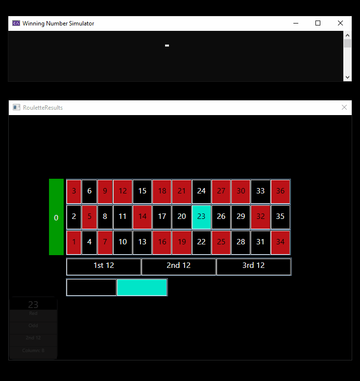

<h1 align="center"> Roulette Casino Game </h1>

 

 

 
Roulette Wheel is represented by Winning Number Simulator which generates the winning number randomly and sends it to RouletteResults over TCP, which displays it on table layout and all the associated data in pop up animation.
Roulette table layout data stored in embeded into application SQLite database

  

 